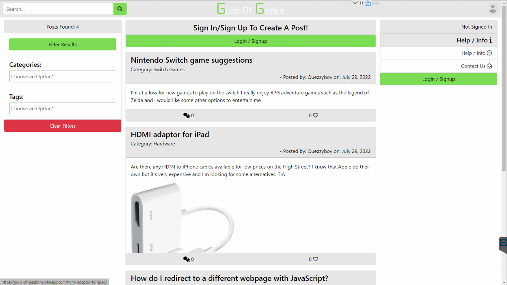

# **Guild Of Geeks** - [Live Site](https://guild-of-geeks.herokuapp.com/)

## **Project Overview**

Guild-Of-Geeks is a nerdy/techy everything and anything platform, designed to facilitate a community of nerds, geeks and techy people. And allow them to share their creations, ask questions, have discussions on their favourite topics and more.

# **Table Of Contents**
- [**Guild Of Geeks** - Live Site](#guild-of-geeks---live-site)
  - [**Project Overview**](#project-overview)
- [**Table Of Contents**](#table-of-contents)
  - [**Planning Phase**](#planning-phase)
  - [**Features**](#features)
  - [**Future Developement**](#future-developement)
  - [**Testing Results**](#testing-results)
  - [**Technologies Used**](#technologies-used)
  - [**Deployment**](#deployment)
  - [**Mentions**](#mentions)
  - [**Credits**](#credits)

## [**Planning Phase**](/docs/PLANNING.md)

## **Features**

This site incorporates a large quantity of features.

- Responsive desgin
  - The site adapts to different devices and screen sizes to ensure the most comfertable viewing experience.
  - 
  - 
- Post search
  - Allows the users to search for specific content, such as posts and categories.
  - 
- Post filters
  - Allows the users to further filter down the list of posts based on specific requirements.
  - 
- Themes
  - Allows the user to select the most comfertable color scheme.
  - 
  - 
- Profile Link
  - Always visable on the navigation bar.
  - Allows the user to quickly access account, help and profile related options at all times.
  - 
- Dynamic Logo
  - Adaptive logo that changes depending on the size of the screen and the theme selected.
  - 
  - 
  - 
- Home Button
  - Allows the user to quickly return to the home page.
  - 
- Dynamic List of Posts
  - Allows the users to view and access all content on the site.
  - 
- Login Option
  - Allow the user to login to their account from anywhere on the site.
  - 
- Signup Option
  - Allows the user to signup for an account from anywhere on the site.
  - 
- New Post Option
  - Allows the user to create new posts, and submit their content.
  - 
- Post Categories
  - Allows the user to specifiy what topic their post relates to.
  - Users can follow posts, to find similar content or keep updated with a conversation they are part of.
  - 
- Post Tags
  - Allows the user to further specify what their post is about, and what kind of conversation they are looking to engage in.
  - Multiple tags can be applied to a single post.
  - 
- SummerNote Editor
  - Allows the user to submit more dynamic and engaging content.
  - Provides the ability to upload varying forms of content, including text, images and videos.
  - 
- Comment Counter
  - Shows the user how many people are involved in the conversation.
  - 
- Post Follow Button
  - Allows the user to follow the post, for quick access later on.
  - 
- Post Like Button
  - Provides the user with a method of demonstrating their interest in the topic at hand.
  - 
- Post Comments
  - Provides the user a method of interacting with the poster.
  - Provides the user with the ability to continue the conversation.
  - 
- Comment Likes
  - Provides the user with the ability to demonstrate their appreciation, agreement with another user.
  - 
- Comment Delete Button
  - Allows the user a method of removing a comment that they not longer feel demonstrates their view.
  - 
- Post Edit Button
  - Allows the user a method of updating or correcting information in a post.
  - 
- User Control Panel
  - Provides the user with quick access to account, adnim and information.
  - 
- Help Page
  - Provides the user with information to assist in their usage of the site.
  - 
- Contact Us Page
  - Allows the user to submit feedback, or ask the development team for support on an issue.
  - 
- Profile Page
  - Provides the user with a method of viewing their personal information, and updating it.
  - 
  - 
- Update Password
  - Allows the user to update their password.
  - 
- Delete Account
  - Allows the user to delete their profile should they wish to leave the site.
  - 
- Admin Section
  - Provides staff with admin access to the site, allowing them to manage content and users.
  - 

## **Future Developement**

There are a multitude of possible features that could be added or implented to further improve the quality of the user's experience on the site. These include but are not limited to:

- Small adjustments to user interaction, for example:
  - Allowing the user's to upload new profile pictures by clicking/tapping their profile photo in the profile page.
- An improve text editor, that allows for easier and more dynaming input of content.
- An FAG page in which user's could ask other community members and staff about the site directly, instead of through the site help category.
- A more feature rich filtering set.

## [**Testing Results**](/docs/TESTING.md)

## [**Technologies Used**](/docs/TECHNOLOGIES.md)

## [**Deployment**](/docs/DEPLOYMENT.md)

## **Mentions**

A special thanks to the very helpful people over on the forums listed in the Technologies page.
Another special thanks to the creators and maintaiers over at W3C, their information and descriptons were often very useful.

## **Credits**

The code used in this project has been created by myself, unless otherwise specified here.
Library specific code such as Select2 Implementation and Bootstrap Timeouts, are the work of their development teams.