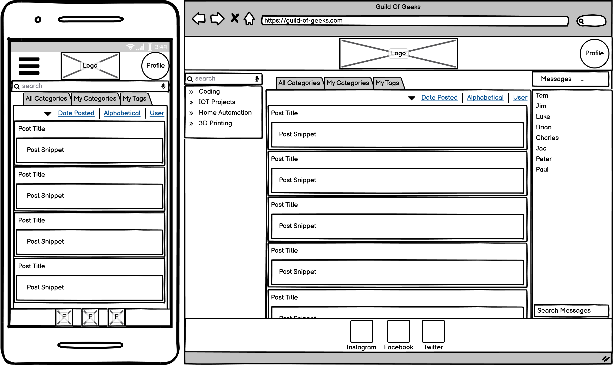
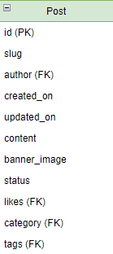
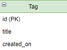

# [**Go Back**](https://github.com/lukebinmore/Guild-Of-Geeks)

# **Table Of Contents**
- [**Go Back**](#go-back)
- [**Table Of Contents**](#table-of-contents)
- [**Planning Phase**](#planning-phase)
  - [**Site Concept**](#site-concept)
  - [**Site Discussion/Goals**](#site-discussiongoals)
    - [**Peer Based Discussion**](#peer-based-discussion)
    - [**Feature Idea/Requiement Review**](#feature-idearequiement-review)
    - [**Finalised Goals/Features**](#finalised-goalsfeatures)
  - [**Site Design**](#site-design)
    - [**Wireframes**](#wireframes)
    - [**Logo**](#logo)
    - [**Color Scheme**](#color-scheme)
    - [**Fonts**](#fonts)
    - [**Database Scheme**](#database-scheme)
  - [**Development Management**](#development-management)
    - [**Development Process**](#development-process)
    - [**Testing Methodologies**](#testing-methodologies)
    - [**Periodic Reviews**](#periodic-reviews)
    - [**User Stories**](#user-stories)

# **Planning Phase**

This document outlines the planning phase of the project, including the following:

- The sites purpose and goals
- The results of a discussion that took place to build the sites feature and requirement list
- The basic design of the site, and reasons for certain astetic choices
- The methodology and processes put in place for development management

***

## **Site Concept**

The basic concept of the site is to provide an IT and gaming related platform. Allowing users to build a community where they can discuss topics of interest, demonstrate their projects and setups, as well as get assistance from like-minded individuals.

***

## **Site Discussion/Goals**

### **Peer Based Discussion**

A discussion relating to this project was held with friends of mine, with ranging ages and IT/gaming related interests. Below is a summarised list of topics, features, suggestions and thoughts raised during said discussion.

- Design Ideas
  - Simple and readable is prefered over flashy and bright
  - Modern style is prefered by majority
- Feature Suggestions/Ideas
  - Dark Mode
    - Selectable in settings
    - Based on OS Setting
  - Categories for different topics
    - Subcategories for more specific posts
    - Likeable Categories
    - New Post Feed for liked categories
  - Follow button for specific posts
  - Different types of posts
    - Code post
    - Video post
    - File upload post
    - Poll post
  - Comment replys
  - Mentions
    - User mentions
    - Post mentions
    - Category mentions
    - Subcategory mentions
  - List of posts
    - Based on liked categories
    - Random categories
    - Followed Posts only
  - User messages
    - Direct user-user messages
    - Group messages
- Points of Concern
  - Don't want another forum only useful for support
  - Too many specific features to make it worth getting used to
  - Information overload if pages are too cluttered
  - Don't want to give away too much personal data

***

### **Feature Idea/Requiement Review**

After the group discussion, the features and points were reviewed to determine importance and viability. During this review, additional features relevant to administration were identified and evaluated as well. The results from this review are highlighted in the table below.

A scoring system of 0-5 (Least to Most) has been utilized. This is based on the time required, and the difficulty relative to my currently level of ability with the required language/framework/service.

| Feature | Importance | Viability/Feasibility |
|---|---|---|
| Admins can delete posts/comments | 5 | 5 |
| Admins can disable accounts | 5 | 5 |
| Users can view a paginated list of posts | 5 | 5 |
| Users can register for an account | 5 | 5 |
| Users can update their profile information | 4 | 5 |
| Users can upload a profile picture | 1 | 3 |
| Users can reset their password | 5 | 3 |
| Users can delete their account | 4 | 5 |
| Users can create new post drafts | 3 | 4 |
| Users can create new posts | 5 | 5 |
| Users can add tags to posts | 2 | 4 |
| Users can comment on posts | 5 | 5 |
| Users can reply to comments | 1 | 3 |
| Users can like comments & posts | 2 | 2 |
| Users can browse posts based on filters | 4 | 3 |
| Users can follow posts | 1 | 1 |
| Users can like categories | 1 | 1 |
| Users can mention other users | 2 | 1 |
| Users can see list of random posts | 5 | 5 |
| Users can see list of posts from liked categories | 2 | 2 |
| Users can see list of their own posts | 5 | 5 |
| Users can message other users | 3 | 4 |
| Users can message in groups | 1 | 1 |
|---|---|---|
|Totals | 76 | 82 |

A user story template was created to allow partakers in the peer discussion to add additional feature requests, that could be added should time permit.

For user stories relating to this project, please [Click Here.](https://github.com/lukebinmore/Guild-Of-Geeks/issues?q=label%3A%22User+Story%22)

***

### **Finalised Goals/Features**

Due to the scores listed above, the time available, and the complexity of each task, i have further categoriesed the tasks above into three distinct categories. Musts, Shoulds and Coulds. These will be used to prioritize work during development, and will be added to the To-Do column of the project board each week, to fullfill 60% Musts, and 40% Shoulds & Coulds.

- Key:
  - M = Must
  - S = Should
  - C = Could

| Feature | Status |
|---|---|
| Admins can delete posts/comments | M |
| Admins can disable accounts | M |
| Users can view a paginated list of posts | M |
| Users can register for an account | M |
| Users can update their profile information | M |
| Users can upload a profile picture | C |
| Users can reset their password | M |
| Users can delete their account | M |
| Users can create new post drafts | M |
| Users can create new posts | M |
| Users can add tags to posts | C |
| Users can comment on posts | M |
| Users can reply to comments | C |
| Users can like comments & posts | S |
| Users can browse posts based on filters | M |
| Users can follow posts | C |
| Users can like categories | S |
| Users can mention other users | S |
| Users can see list of random posts | M |
| Users can see list of posts from liked categories | S |
| Users can see list of their own posts | M |
| Users can message other users | S |
| Users can message in groups | C |

To view the project board for this site, please [Click Here.](https://github.com/lukebinmore/Guild-Of-Geeks/projects/1)

***

## **Site Design**

### **Wireframes**

Below are the basic initial wireframes for the site created with [Balsamiq Wireframes](https://balsamiq.com/). This basic design may evolve and change based on fluctuations with the User Stories.

**Landing Page:**

**Profile Page:**

**New Post Page:**

**Post Page:**

***

### **Logo**

The site logo's were created using the free trial service at [Canva.com.](https://www.canva.com/)

**Large:**

**Large Inverted (For Dark Mode):**

**Small:**

***

### **Color Scheme**

The color scheme in use has been generated based on the logo, utilizing the same or similar colors to aid in creating a uniform design.

| Color Image | Color Hex Code | Color Name |
|---|---|---|
|  | #7CDC54 | Pastel Green |
|  | #040404 | Black |
|  | #fff | White |
|  | #CBCBCB | Ghost |

***

### **Fonts**

Fonts were selected from [Google Fonts](https://fonts.google.com/) based on how they looked in the given color scheme, and how they suited the relevant topics that will be present on the site.

**Headings/Titles: Anton**

**Other Text: Nunito**

<!--
@import url('https://fonts.googleapis.com/css2?family=Anton&family=Nunito&display=swap');
-->

***

### **Database Scheme**

Below are the planned fields for each table in the database for the site. Created in [Diagrams.net.](https://app.diagrams.net/)

**User Table:**

**Post Table:**

**Comment Table:**

**Tag Table:**

**Message Table:**

***

## **Development Management**

### **Development Process**

This project will be developed using the Agile process, incorporating an iterative approach to progression and prioritisation. GitHub's Issue's and Project (KanBan) features will be used to track progress during the development lifecycle, utlizing the MoSCoW methodology to manage task priority and iteration assignement.

***

### **Testing Methodologies**

During each iteration, the project will be manually tested for bugs and issues. On encountering an issue or bug, a commit will be made with a message detailing the bug found and the solution implemented to resolve it.

For bugs found and fixed during the development of this project, please [Click Here.](https://github.com/search?q=repo%3Alukebinmore%2FGuild-Of-Geeks+%22Bug+Fix+-+%22&type=commits)

In addition to this, django.test will be used during this project to test for bugs relating to urls, forms and models.

***

### **Periodic Reviews**

Each iteration will span one week, with a review held at the end of each week to review progress and update the remaining user stories. Incompleted items will be moved back into the backlog to be added back into the To-Do list for a future iteration when possible.

To view the project (KanBan) for this site, please [Click Here.](https://github.com/lukebinmore/Guild-Of-Geeks/projects/1)

***

### **User Stories**

For user stories relating to this project, please [Click Here.](https://github.com/lukebinmore/Guild-Of-Geeks/issues?q=label%3A%22User+Story%22)

***